# 🔬 Single-Cell RNA-seq Analysis with Seurat

This pipeline performs clustering, visualization, and annotation of PBMC 10k scRNA-seq data using Seurat and SingleR.

---

## 📦 Required Packages

```r
install.packages("Seurat")
install.packages("tidyverse")
install.packages("patchwork")
if (!requireNamespace("BiocManager", quietly = TRUE)) install.packages("BiocManager")
BiocManager::install("SingleR")
BiocManager::install("celldex")
📁 Dataset
🔗 Download PBMC 10k v3 Raw Feature Matrix (.h5)

🧪 Quality Control (QC)
Calculate mitochondrial and ribosomal gene percentages:

r
Copy
Edit
PBMCs.seurat.obj[["percent.mt"]] <- PercentageFeatureSet(PBMCs.seurat.obj, pattern = "^MT-")
PBMCs.seurat.obj[["percent.rb"]] <- PercentageFeatureSet(PBMCs.seurat.obj, pattern = "^RP[SL]")
🖼️ Raw QC Scatter Plots

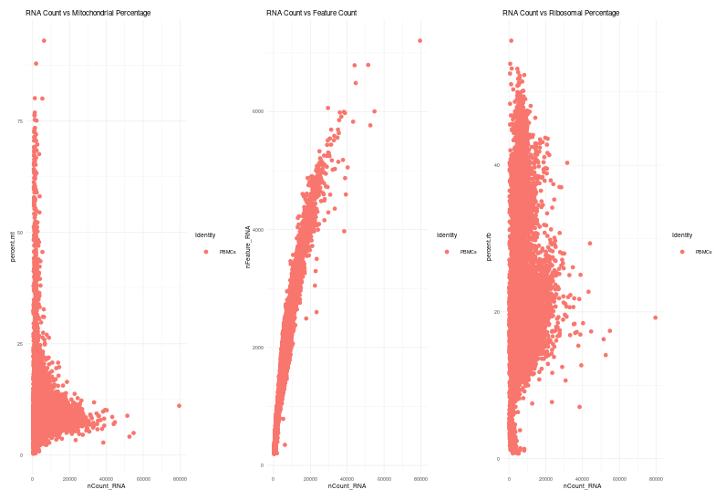
🧹 Filtering and Normalization
r
Copy
Edit
PBMCs.seurat.obj <- subset(PBMCs.seurat.obj, subset = nCount_RNA < 75000 &
                           nFeature_RNA < 5000 &
                           percent.mt < 15 &
                           percent.rb < 50)

PBMCs.seurat.obj <- NormalizeData(PBMCs.seurat.obj, normalization.method = "LogNormalize", scale.factor = 10000)
🖼️ Filtered Violin Plot

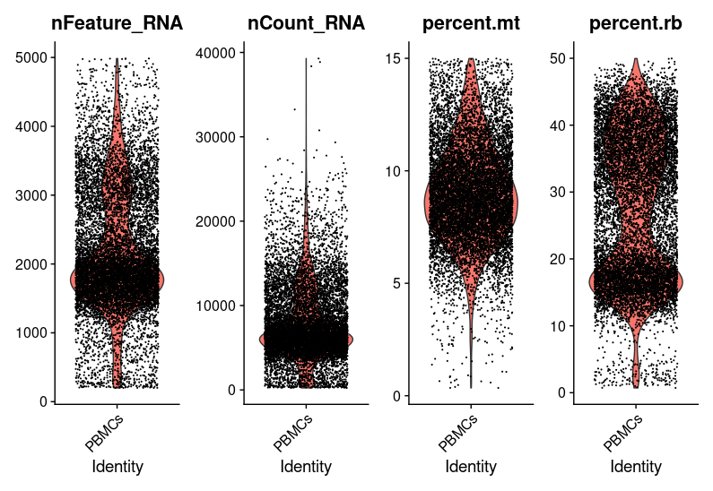
🔍 Highly Variable Genes
r
Copy
Edit
PBMCs.seurat.obj <- FindVariableFeatures(PBMCs.seurat.obj, selection.method = "vst", nfeatures = 3000)
🖼️ Top 10 Variable Genes

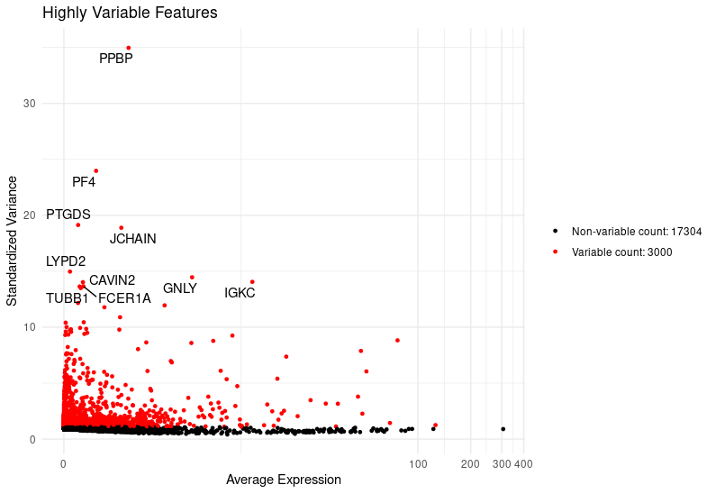
📈 Dimensionality Reduction (PCA)
r
Copy
Edit
PBMCs.seurat.obj <- RunPCA(PBMCs.seurat.obj)
ElbowPlot(PBMCs.seurat.obj)
🖼️ Elbow Plot

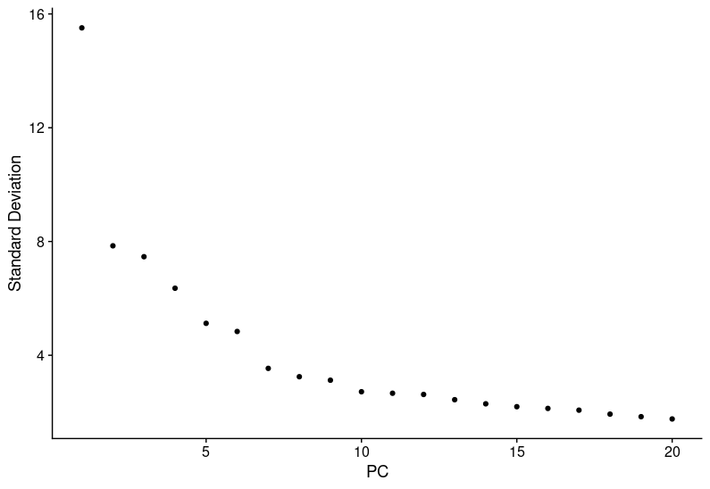
🖼️ PCA Plot

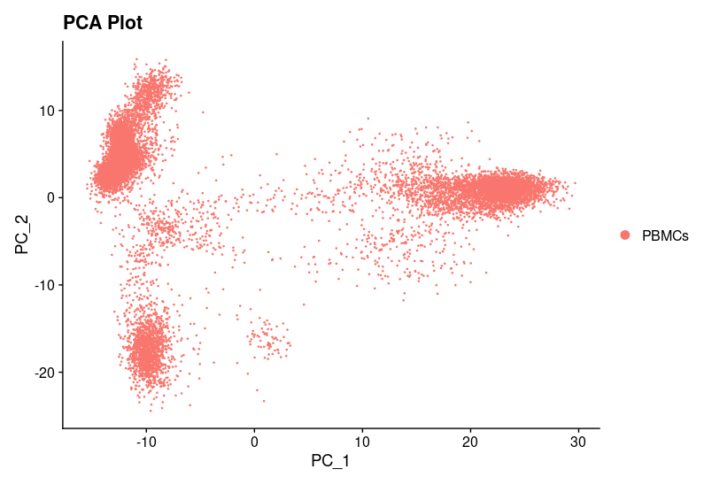
🔬 Clustering and UMAP/t-SNE
r
Copy
Edit
PBMCs.seurat.obj <- FindNeighbors(PBMCs.seurat.obj, dims = 1:15)
PBMCs.seurat.obj <- FindClusters(PBMCs.seurat.obj, resolution = 0.1)
PBMCs.seurat.obj <- RunUMAP(PBMCs.seurat.obj, dims = 1:15)
PBMCs.seurat.obj <- RunTSNE(PBMCs.seurat.obj, dims = 1:15)
🖼️ UMAP Plot

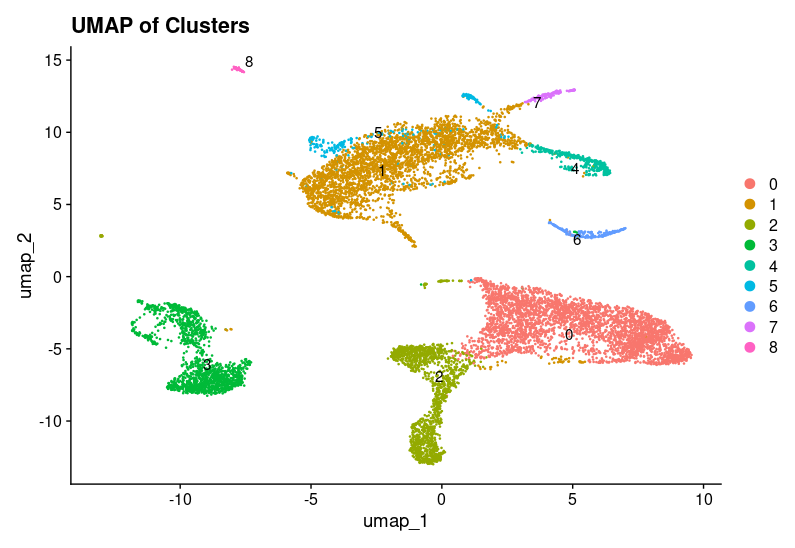
🖼️ t-SNE Plot

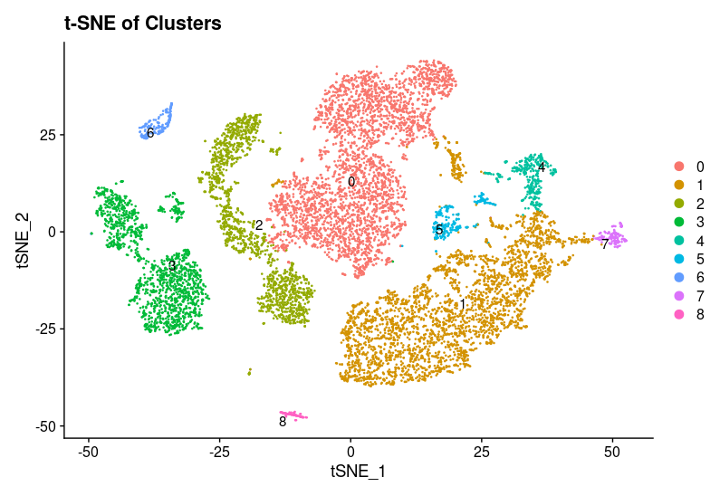
🧬 Marker Gene Identification
r
Copy
Edit
PBMCs.seurat.obj.marker <- FindAllMarkers(PBMCs.seurat.obj, only.pos = TRUE, min.pct = 0.25, logfc.threshold = 0.5)
🖼️ Feature Plot of Top Markers

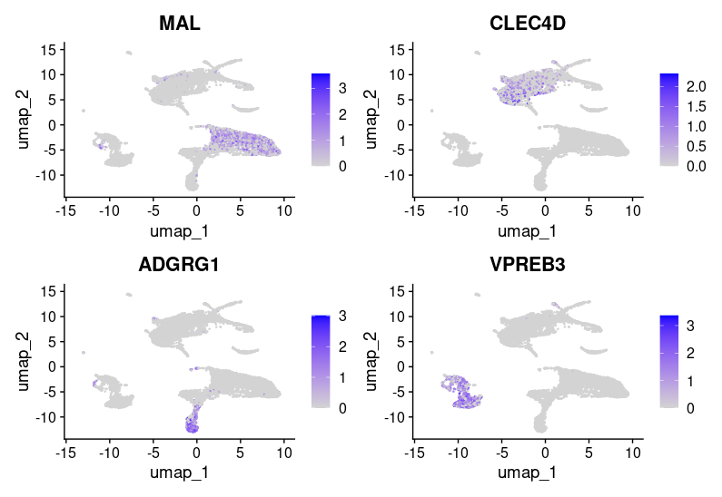
🧠 Cell Type Annotation (SingleR)
r
Copy
Edit
ref_human_primary <- celldex::HumanPrimaryCellAtlasData()
ref_blueprint <- celldex::BlueprintEncodeData()
results_primary <- SingleR(test = sce, ref = ref_human_primary, labels = ref_human_primary$label.main)
results_blueprint <- SingleR(test = sce, ref = ref_blueprint, labels = ref_blueprint$label.main)
🖼️ Annotation Score Heatmaps

Human Atlas:

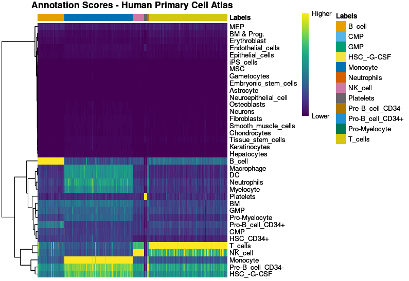
Blueprint/ENCODE:

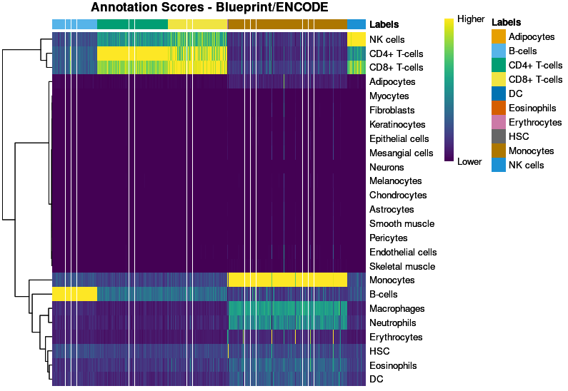
🧬 Final Annotated Clusters
r
Copy
Edit
PBMCs.seurat.obj <- SetIdent(PBMCs.seurat.obj, value = "celltype_consensus")
DimPlot(PBMCs.seurat.obj, label = TRUE)
🖼️ Final Cell Type UMAP

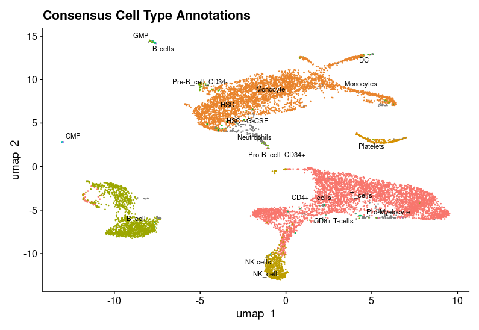 ```
